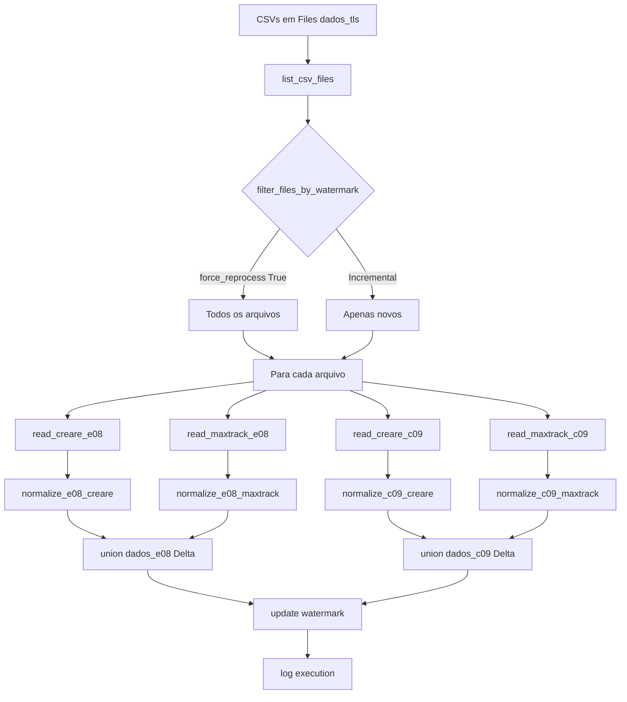

# Documentação Técnica: copyjob_telemetry_tls

> **Ambiente:** Microsoft Fabric — Synapse PySpark  
> **Lakehouse padrão:** `lk_dados_raw` (ID: `9c3b03cd-2a8a-4157-a83b-9406002a5ceb`)  
> **Schema de destino:** `telemetry_analytics`

---

## Visão Geral

Este notebook implementa um **pipeline de ingestão incremental** de dados de telemetria de frotas, consolidando arquivos CSV provenientes de **dois sistemas de rastreamento**:

| Sistema | Tipo de Relatório | Nome no Arquivo |
|---------|-----------------|-----------------|
| **CREARE** | E08 (Macro/Eventos) | sem "MaxTrack" no nome |
| **CREARE** | C09 (Permanência em POIs) | sem "MaxTrack" no nome |
| **MAXTRACK** | E08 (Macro/Eventos) | contém "MaxTrack" no nome |
| **MAXTRACK** | C09 (Permanência em POIs) | contém "MaxTrack" no nome |

Os dados são gravados como tabelas Delta no lakehouse, com controle de **watermark incremental** e **log de execução**.

---

## Arquitetura do Pipeline



---

## Células do Notebook

### Célula 1 — Configuração do Parser Spark

```python
spark.conf.set("spark.sql.legacy.timeParserPolicy", "LEGACY")
```

> **Motivo:** Garante compatibilidade com formatos de data legados (ex.: `dd/MM/yyyy`) ao usar `to_date` / `to_timestamp` no Spark.

---

### Célula 2 — Imports e Inicialização da Execução

**Bibliotecas importadas:**

| Biblioteca | Uso |
|---|---|
| `pyspark.sql.functions` | Transformações nos DataFrames Spark |
| `pyspark.sql.types` | Definição de schemas |
| `datetime`, `timezone` | Controle de timestamps UTC |
| `re` | Extração de datas por regex nos nomes de arquivo |
| `uuid` | Geração do `run_id` único por execução |
| `unicodedata` | Normalização de caracteres com acento nas colunas |
| `pandas`, `numpy` | Leitura local dos CSVs antes de converter para Spark |

**Variáveis globais de execução:**
- `run_id` — UUID único gerado a cada execução (rastreabilidade)
- `start_ts` — Timestamp UTC de início

---

### Célula 3 — Configurações do Pipeline

| Parâmetro | Valor Padrão | Descrição |
|---|---|---|
| `base_path` | `Files/dados_tls` | Pasta dos arquivos CSV no lakehouse |
| `target_schema` | `telemetry_analytics` | Schema Delta de destino |
| `target_table_e08` | `dados_e08` | Tabela para relatórios do tipo E08 |
| `target_table_c09` | `dados_c09` | Tabela para relatórios do tipo C09 |
| `watermark_table` | `telemetry_analytics.watermark_control` | Tabela de controle incremental |
| `log_table` | `telemetry_analytics.execution_log` | Tabela de log de execuções |
| `force_reprocess` | `True` | Se `True`, ignora a watermark e reprocessa **todos** os arquivos |
| `force_date` | `None` | Data mínima forçada para filtro (`"yyyy-MM-dd"`) |
| `ENCODING` | `ISO-8859-1` | Encoding padrão dos CSVs |

> [!IMPORTANT]
> `force_reprocess = True` está ativado por padrão. Altere para `False` após a carga inicial para execuções incrementais.

---

### Célula 4 — Criação das Tabelas de Controle

Cria (se não existir) o schema e as duas tabelas Delta de controle:

#### `telemetry_analytics.watermark_control`

| Coluna | Tipo | Descrição |
|---|---|---|
| `target_table` | STRING | Nome da tabela monitorada |
| `last_date` | DATE | Última data processada com sucesso |
| `last_update` | TIMESTAMP | Timestamp da última atualização |

#### `telemetry_analytics.execution_log`

| Coluna | Tipo | Descrição |
|---|---|---|
| `run_id` | STRING | ID único da execução |
| `target_table` | STRING | Tabela processada |
| `status` | STRING | `SUCCESS`, `PARTIAL`, `SKIPPED` ou `ERROR` |
| `start_ts_utc` | TIMESTAMP | Início da execução (UTC) |
| `end_ts_utc` | TIMESTAMP | Fim da execução (UTC) |
| `duration_seconds` | DOUBLE | Duração total em segundos |
| `files_discovered` | INT | Total de arquivos encontrados |
| `files_selected` | INT | Arquivos selecionados após filtro de watermark |
| `watermark_before` | DATE | Watermark antes do processamento |
| `watermark_after` | DATE | Nova watermark após processamento |
| `rows_read` | LONG | Linhas lidas |
| `rows_written` | LONG | Linhas gravadas |
| `error_message` | STRING | Mensagem de erro (máx. 4000 chars) |

---

### Célula 5 — Funções de Controle

#### `get_watermark(table_name) → date | None`
Consulta a tabela `watermark_control` e retorna a última data processada para a tabela informada.

#### `update_watermark(table_name, new_date)`
Faz um `MERGE INTO` na tabela `watermark_control`, atualizando ou inserindo o registro da tabela.

#### `log_execution(...)`
Escreve um registro de log na tabela `execution_log` no formato **append**. Trunca `error_message` a 4000 caracteres.

#### `extract_file_date(filepath) → date | None`
Extrai a data do nome do arquivo por regex, suportando dois formatos:
- `YYYYMMDD` (ex.: `Relatorio_E08_20250301.csv`)
- `YY-MM-DD` ou `DD-MM-YY` (ex.: `Relatorio_25-03-01.csv`)

Registrada como UDF Spark: `extract_file_date_udf`.

---

### Célula 6 — Pipeline de Leitura Robusto

#### `_normalize_columns(pdf) → DataFrame`
Normaliza os nomes das colunas de um DataFrame Pandas:
1. Remove espaços extras
2. Normaliza Unicode (NFKD)
3. Remove acentos (encode ASCII, ignore)
4. Substitui caracteres especiais por `_`
5. Remove underscores duplicados e nas extremidades
6. Converte para minúsculas

#### `auto_detect_skiprows(filepath, expected_columns, encoding) → int`
Detecta automaticamente quantas linhas inicias do CSV devem ser ignoradas (cabeçalho deslocado). Testa de 0 a 9 linhas e retorna o primeiro `skip` que contém ao menos uma das colunas esperadas.

#### Funções de Leitura CSV

| Função | Sistema | Tipo | Detalhes |
|---|---|---|---|
| `read_creare_e08_spark(filepath)` | CREARE | E08 | encoding `cp1252`, `skiprows=4` |
| `read_creare_c09_spark(filepath)` | CREARE | C09 | encoding `cp1252`, `skiprows=4` |
| `read_maxtrack_macro_spark(filepath)` | MAXTRACK | E08 | auto-detect encoding e skiprows; espera colunas `Placa`, `Frota`, `Latitude`, `Longitude` |
| `read_maxtrack_permanencia_spark(filepath)` | MAXTRACK | C09 | auto-detect; espera colunas `Empresa`, `Cliente`, `Operador`, `Tipo de operacao` |

**`_read_maxtrack_csv`** tenta encodings em ordem: `utf-8-sig → cp1252 → iso-8859-1`, com fallback automático.

---

### Célula 7 — Funções de Normalização (Schema Unificado)

#### `apply_column_map(df, column_map)`
Renomeia colunas conforme um dicionário de mapeamento. Usado para corrigir variações de nome entre versões dos arquivos MAXTRACK.

**Mapeamento C09 MAXTRACK:**
```python
COLUMN_MAP_C09_MAXTRACK = {
    "motorista_sai_da": "motorista_saida",
}
```

#### `fix_schema_drift(df, expected_columns, cutoff=0.7)`
Usa `difflib.get_close_matches` para renomear automaticamente colunas com nomes similares às esperadas, tolerando drift de schema (mudanças graduais de nomenclatura entre versões dos arquivos).

---

#### Schema Unificado — Tabela `dados_e08`

| Coluna Destino | Fonte CREARE | Fonte MAXTRACK |
|---|---|---|
| `source_file` | nome do arquivo | nome do arquivo |
| `source_system` | `"CREARE"` | `"MAXTRACK"` |
| `event_date` | `data` (dd/MM/yyyy) | derivado de `data` |
| `event_time` | `hora` | derivado de `data` |
| `event_datetime` | `data` + `hora` | `data` (com fallback de formato) |
| `branch` | `filial` | `clientes` |
| `vehicle` | `veiculo` | `placa` + ` - ` + `frota` |
| `driver` | `motorista` | `nome_do_motorista` |
| `event_code` | `codigo_evento` | `null` |
| `event_description` | `descricao_evento` | `nome_da_operacao` |
| `data_entry_code` | `cod_ent_dados` | `null` |
| `data_entry_desc` | `descricao_entrada` | `null` |
| `data_entry_value` | `entrada_dados` | `referencia \| detalhes` |
| `odometer` | `hodometro` (vírgula→ponto, double) | `odometro` (double) |
| `hourmeter` | `horimetro` | `null` |
| `distance` | `distancia` (vírgula→ponto, double) | `null` |
| `duration` | `duracao_evento` | `tempo_de_permanencia_segundos` |
| `trip_number` | `numero_viagem` | `null` |
| `project_code` | `codigo_projeto` | `null` |
| `project_name` | `nome_projeto` | `null` |
| `ingest_timestamp` | `current_timestamp()` | `current_timestamp()` |

---

#### Schema Unificado — Tabela `dados_c09`

| Coluna Destino | Fonte CREARE | Fonte MAXTRACK |
|---|---|---|
| `source_file` | nome do arquivo | nome do arquivo |
| `source_system` | `"CREARE"` | `"MAXTRACK"` |
| `company` | `empresa` | `empresa` |
| `poi_name` | `ponto_de_interesse` | `nome_da_area` |
| `vehicle` | `veiculo` | `placa` + ` - ` + `frota` |
| `driver_in` | `motorista_entrada` | `motorista_entrada` |
| `odometer_in` | `hodometro_entrada` (double) | `odometro_inicial` (double) |
| `datetime_in` | `data_entrada` (dd/MM/yyyy HH:mm:ss) | `data_de_entrada` (dd/MM/yyyy HH:mm:ss) |
| `driver_out` | `motorista_saida` | `motorista_saida` *(via column_map)* |
| `odometer_out` | `hodometro_saida` (double) | `odometro_final` (double) |
| `datetime_out` | `data_saida` (dd/MM/yyyy HH:mm:ss) | `data_de_saida` (dd/MM/yyyy HH:mm:ss) |
| `fuel_level_in_pct` | `nivel_de_combustivel_inicial` (double) | `null` |
| `fuel_level_out_pct` | `nivel_de_combustivel_final` (double) | `null` |
| `dwell_time_text` | `tempo_de_permanencia` | `tempo_dentro_da_area` |
| `hourmeter_in` | `horimetro_inicial` | `null` |
| `hourmeter_out` | `horimetro_final` | `null` |
| `engine_on_time` | `tempo_de_motor_ligado` | `null` |
| `notes` | `observacoes` | `null` |
| `event_date` | `data_entrada` (date) | `data_de_entrada` (date) |
| `ingest_timestamp` | `current_timestamp()` | `current_timestamp()` |

---

### Célula 8 — Orquestração do Pipeline: `list_csv_files`, `filter_files_by_watermark` e `run_pipeline`

#### `list_csv_files(base_path, report_type, source=None)`
- Lista arquivos `.csv` cujo nome contém `_E08` ou `_C09`
- Filtra por sistema: `CREARE` (sem "MaxTrack"), `MAXTRACK` (com "MaxTrack"), ou ambos

#### `filter_files_by_watermark(files, watermark_date)`
- Se `force_reprocess=True`: retorna todos os arquivos
- Caso contrário: usa `force_date` ou `watermark_date` como data mínima e filtra pelo nome do arquivo

#### `run_pipeline(report_type, target_table, source=None)`

Executa o pipeline completo em **7 etapas**:

```
1. Consulta a watermark atual
2. Lista e filtra os arquivos CSV
3. Para cada arquivo: lê e normaliza (com tratamento de erro por arquivo)
4. Consolida todos os DataFrames via unionByName (allowMissingColumns=True)
5. Escreve na tabela Delta (append + mergeSchema=true)
6. Atualiza a watermark com a maior data dos arquivos processados
7. Registra o log de execução
```

**Status possíveis no log:**

| Status | Condição |
|---|---|
| `SUCCESS` | Todos os arquivos processados sem erro |
| `PARTIAL` | Ao menos um arquivo falhou, mas outros foram processados |
| `SKIPPED` | Nenhum arquivo novo encontrado após filtro de watermark |
| `ERROR` | Nenhum arquivo foi processado com sucesso (exceção relançada) |

---

### Célula 9 — Execução: Parte 1 (CREARE)

```python
run_pipeline('E08', target_table_e08, source='CREARE')
run_pipeline('C09', target_table_c09, source='CREARE')
```

---

### Célula 10 — Execução: Parte 2 (MAXTRACK)

```python
run_pipeline('E08', target_table_e08, source='MAXTRACK')
run_pipeline('C09', target_table_c09, source='MAXTRACK')
```

> [!NOTE]
> A execução é dividida em duas células (CREARE e MAXTRACK) para facilitar o debugging isolado por sistema de origem. Cada chamada é independente e registra seu próprio log.

---

## Dependências e Requisitos

| Requisito | Detalhe |
|---|---|
| **Runtime** | Synapse PySpark (Microsoft Fabric) |
| **Lakehouse** | `lk_dados_raw` montado no ambiente |
| **`mssparkutils`** | Utilitário Fabric para listar arquivos (`fs.ls`) |
| **Spark conf** | `spark.sql.legacy.timeParserPolicy = LEGACY` |
| **Permissões** | Leitura em `Files/dados_tls`, escrita em `telemetry_analytics.*` |
| **Formato dos CSVs** | Separador `;`, encodings: `cp1252` (CREARE) ou `utf-8-sig`/`cp1252`/`iso-8859-1` (MAXTRACK) |

---

## Observações e Pontos de Atenção

> [!WARNING]
> `force_reprocess = True` está **ativado por padrão**. Em produção, deve ser alterado para `False` para evitar duplicações na tabela Delta.

> [!TIP]
> A escrita usa `mergeSchema = true`, o que permite evolução de schema automaticamente caso novos arquivos introduzam colunas adicionais. Porém, isso pode causar degradação de performance com muitas colunas ao longo do tempo. Considere usar `OPTIMIZE` e `VACUUM` periodicamente.

> [!NOTE]
> O campo `duration` na tabela `dados_e08` tem semânticas diferentes entre sistemas: no CREARE é texto (`duracao_evento`), no MAXTRACK é um número em segundos (`tempo_de_permanencia_segundos`). Considere normalizar para um tipo numérico único.

> [!NOTE]
> Linhas com erro em um arquivo específico são registradas em `file_errors` e logadas com status `PARTIAL`, mas não interrompem o processamento dos demais arquivos.
